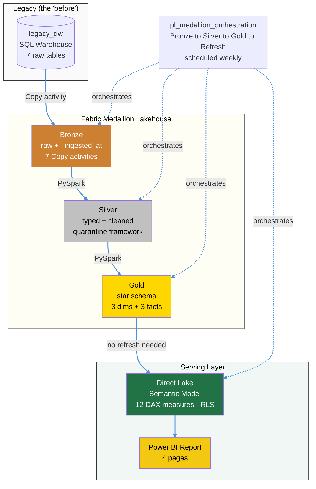
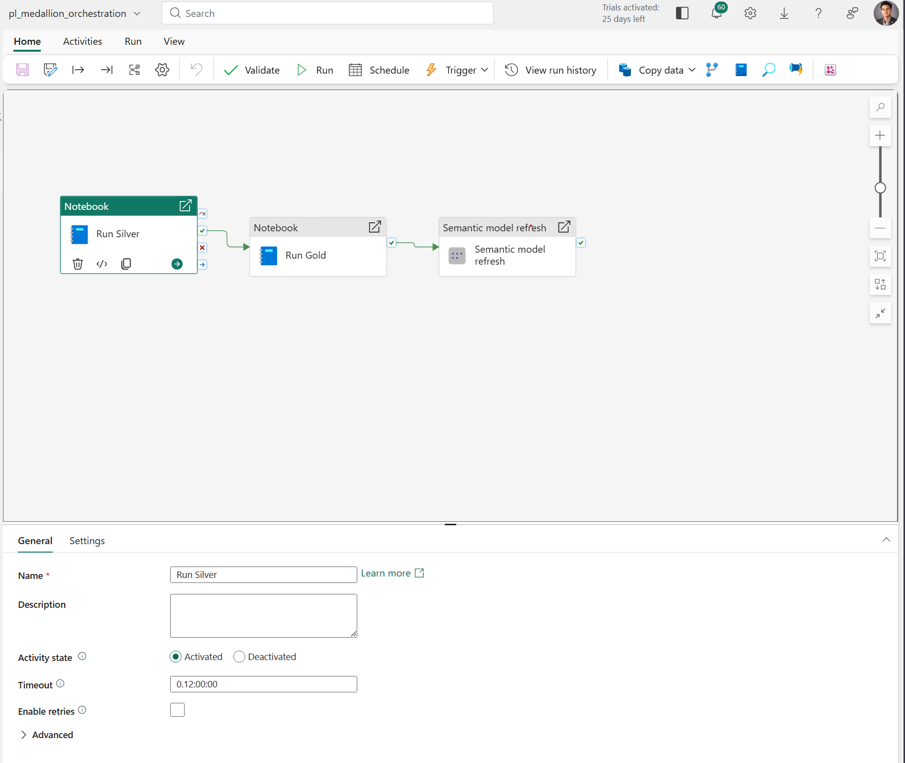
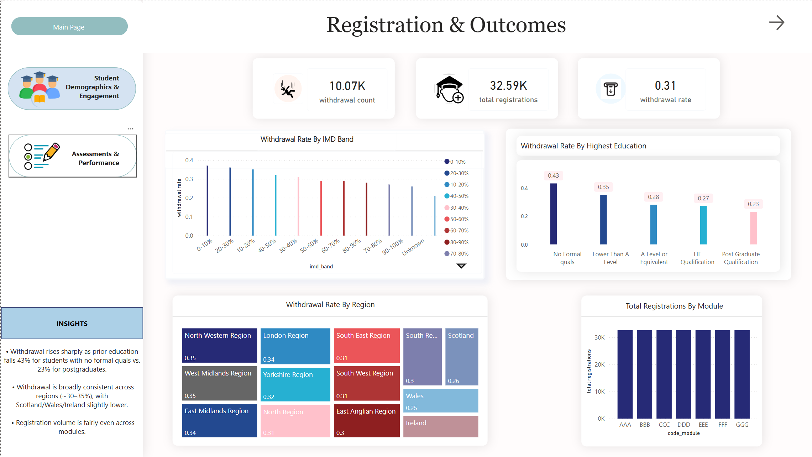
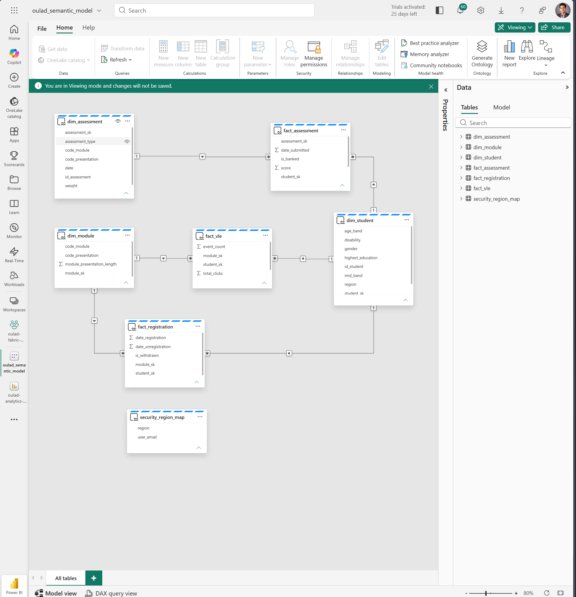
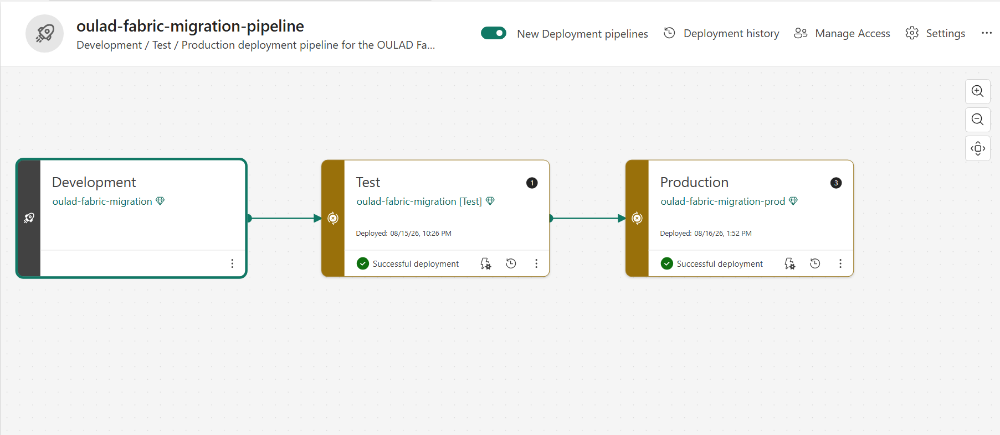

# Legacy-to-Fabric Migration: OULAD Student Analytics

A production-style migration of a legacy SQL Server / SSIS reporting workload into a **Microsoft Fabric** Lakehouse, using a Bronze/Silver/Gold **medallion architecture**, a **Kimball star schema**, a governed **Direct Lake** semantic model, and a multi-page Power BI report orchestrated end-to-end and validated with reconciliation at every layer.

Built on the **Open University Learning Analytics Dataset (OULAD)** 28,785 students, 32,593 registrations, and a 10.7M-row engagement clickstream.



## Looking for something specific?

- **Data Engineering:** Keep reading below for architecture, CI/CD, and engineering decisions.
- **BI & Data Analysis:** See [`docs/bi-report-summary.md`](docs/bi-report-summary.md) for the findings, recommendations, and statistical validation no Power BI required to read it.


## Why this project

Legacy BI stacks built on SQL Server + SSIS tend to share the same pain: tight coupling, no data lineage, no version control, and manual reprocessing. This project re-architects that pattern into a governed, reproducible Fabric Lakehouse, and validates the migration end-to-end with row-count reconciliation at every layer.

The goal was fidelity, not just a demo: a real legacy warehouse stands in as the source, so the "SQL Server to Fabric" path is literal and reconcilable, with a monolithic legacy T-SQL transform preserved as the documented "before" baseline.

## Architecture

`pl_medallion_orchestration` is the single entry point for the whole pipeline, scheduled weekly: it invokes `pl_bronze_ingest` (7 Copy activities, `legacy_dw` to Bronze), then chains into the Silver notebook, the Gold notebook, and a semantic model refresh each step gated on the previous one succeeding.



- **Bronze**: raw ingestion via 7 Copy activities, preserved as-is with `_ingested_at` audit lineage. Reconciled against `legacy_dw` row counts on every run (asserted, not eyeballed).
- **Silver**: typed and cleaned in PySpark: imputation, standardization, derived flags, a validation/quarantine framework, and clickstream aggregation (10.7M to 8.5M rows, validated lossless via `assert`).
- **Gold**: Kimball star schema: 3 dimensions, 3 fact tables, surrogate keys; every fact join asserts zero null keys and the expected row count (catches fan-out immediately, not after the fact). The high-volume engagement fact is tuned with Delta OPTIMIZE.
- **Semantic model**: Direct Lake over Gold; star relationships; 12 DAX measures; dynamic row-level security via a region-mapping table and Entra ID identity.
- **Report**: four-page Power BI report (Overview, Registrations & Outcomes, Demographics & Engagement, Assessments & Performance).



## Data model (Gold)

**Dimensions**
- `dim_student` (28,785) one row per student
- `dim_module` (22) course offerings
- `dim_assessment` (206) assessments

**Facts**
- `fact_assessment` (173,912) assessment scores
- `fact_vle` (8,459,320) aggregated engagement (clicks per student-material-day)
- `fact_registration` (32,593) enrollment outcomes incl. withdrawal

`dim_student` is a conformed dimension feeding all three facts.



## Key engineering decisions

- **Re-architect, not lift-and-shift** the medallion pattern directly addresses the legacy stack's coupling, lineage, and reprocessing problems.
- **Reconciliation at every layer, asserted not eyeballed** source baselines captured first, every layer validated against them in code (e.g. `sum(event_count) = 10,655,280` proves the clickstream aggregation was lossless, enforced with an `assert`, not just printed).
- **Quarantine over drop** invalid records are routed to a quarantine table, never silently dropped.
- **SCD2 evaluated, then dropped** first built `dim_student` as SCD2, but OULAD records attributes per-registration with no temporal change timeline, so Type 2 versioning wasn't meaningful it also fanned out the fact join (173,912 to 174,726). Rebuilt as a clean one-row-per-student dimension via `row_number()`; documented SCD2 as the design for a source with real temporal change data.
- **Surrogate keys + skinny facts** facts carry keys and measures only; descriptive attributes live in dimensions. Fan-out bugs are caught by an `assert` on row count and
  null-key checks immediately after every join, not discovered downstream.
- **Performance tuning** the 8.5M-row engagement fact is compacted with Delta OPTIMIZE; file count is captured before/after each run rather than cited as a fixed number, since it varies run to run.


## CI/CD

A three-stage Fabric Deployment Pipeline (Development to Test to Production) promotes every item, Lakehouses, notebooks, pipelines, the Warehouse, the semantic model, and the report, across three independent Fabric Trial workspaces. Each stage was verified with a real, unattended `pl_medallion_orchestration` run, 'not just a successful deployment, but Bronze through the semantic model refresh actually passing its reconciliation asserts in each environment.



**What deployment actually carries 'and what it doesn't.** Fabric's Deployment
Pipelines promote item *definitions*, not their contents. Promoting to a new stage does not carry:
- **Delta table data** a promoted Lakehouse is a real, working item with zero rows.
- **Files-section content** raw CSVs sitting in a Lakehouse's `Files/` folder don't travel with the deployment; they have to be re-uploaded per stage.
- **Working connections** Copy activities in a promoted pipeline reference connection objects that can silently fail to rebind to the new stage's own data sources, even when every visible setting (workspace ID, database ID) looks correct.

Each of these surfaced as a real failure during promotion to Test, diagnosed from the raw error text rather than assumed:
- An empty destination table produces a `SqlFailedToConnect` / "database not found or insufficient permissions" error, misleading on first read, since the database *is* found; the actual issue is zero rows, not access.
- A missing raw file produces a `PathNotFound` error at the exact `Files/raw/` path that never got carried across.
- A genuinely stale connection object, same database, same credentials, still failing, was resolved by creating one new Copy activity from scratch. That single fresh connection cascaded to fix the other six activities sharing the same underlying stale reference, without needing to rebuild all seven by hand.

**Continuous Integration** runs via GitHub Actions on every push to `main`,
validating: all `pipeline-content.json` files are well-formed JSON, all `.platform` item-metadata files are well-formed JSON, and every `notebook-content.py` file compiles without a Python syntax error. This is a syntax-level check, not a semantic one, it would not, for example, have caught an empty-but-valid pipeline (the Bronze gap described earlier in this README), but it does catch real corruption: a bad merge, a manual edit that breaks JSON structure, or a notebook cell committed with a typo before ever being run.

## Governance

- **Row-level security (RLS)** dynamic, table-driven: a `security_region_map` table (`user_email` to `region`) filters `dim_student` via DAX, propagating through the star to all three facts. Adding a user is an `INSERT`, not a role edit.
- **Column-level / object-level security evaluated, not implemented.** `imd_band` (a socioeconomic indicator) was identified as the sensitive column worth restricting. Object-level security (OLS) at the semantic-model layer the natural fit alongside the existing DAX-based RLS isn't currently exposed in Fabric's web-based semantic model editor; it requires an external tool (Tabular Editor) connecting over the XMLA endpoint. Documented here as the next governance layer to add, same as SCD2 above: evaluated deliberately, not overlooked.
- **Assume referential integrity** enabled on fact-to-dimension relationships, validated by zero-orphan key checks, for faster Direct Lake joins.

## Headline findings

- **~31% of registrations end in withdrawal** the dataset's primary attrition signal.
- **Lower prior education strongly predicts withdrawal** 43% (no formal quals) vs. 23% (postgraduate).
- **Coursework outscores exams** (CMA/TMA higher than final exams).
- **Attrition is via withdrawal, not failure** pass rates run 89–98%, so the risk is students leaving, not failing.

## Tech stack

Microsoft Fabric · OneLake · Delta Lake · PySpark · Spark SQL · T-SQL · Kimball dimensional modeling · Direct Lake · Power BI · DAX (RLS) · Entra ID · Fabric Data Pipelines · Git integration

## Repository structure

```
legacy-to-fabric-migration/
├── docs/                              # diagnostics, legacy baseline, migration strategy, interview notes
├── assets/                            # screenshots referenced in this README
├── analysis/                          # contains ad-hoc analysis on Jupyter Notebook and SQL queries
├── legacy/                            # monolithic legacy T-SQL transform (the "before" baseline)
├── legacy_dw.Warehouse/               # legacy SQL Server stand-in
├── CopyJob_1.CopyJob, CopyJob_2.CopyJob/  # load raw CSVs into legacy_dw
├── bronze.Lakehouse/  silver.Lakehouse/  gold.Lakehouse/   # medallion layers
├── nb_bronze_reconciliation.Notebook/ # asserts Bronze == legacy_dw row counts
├── nb_silver_transform.Notebook/      # typed, cleaned, quarantine framework
├── nb_gold_transform.Notebook/        # dimensional model + fact joins, asserted
├── pl_bronze_ingest.DataPipeline/     # legacy_dw to Bronze, 7 Copy activities
├── pl_medallion_orchestration.DataPipeline/  # single entry point, scheduled weekly
├── oulad_semantic_model.SemanticModel/
├── oulad-analytics-report.Report/
└── README.md
```

## Documentation

- `docs/migration-strategy.md` as-is / to-be architecture, table mapping, cutover and reconciliation approach.
- `docs/legacy_baseline.md` the legacy system's structure, type debt, and data-quality gaps.
- `docs/diagnostics.sql` source data inspection with findings and decisions.
- `docs/interview-notes.md` engineering decisions, rationale, and metrics captured during the build.

## Dataset

Open University Learning Analytics Dataset (OULAD) Kuzilek, J., Hlosta, M., & Zdrahal, Z. (2017). Publicly available for research use.
