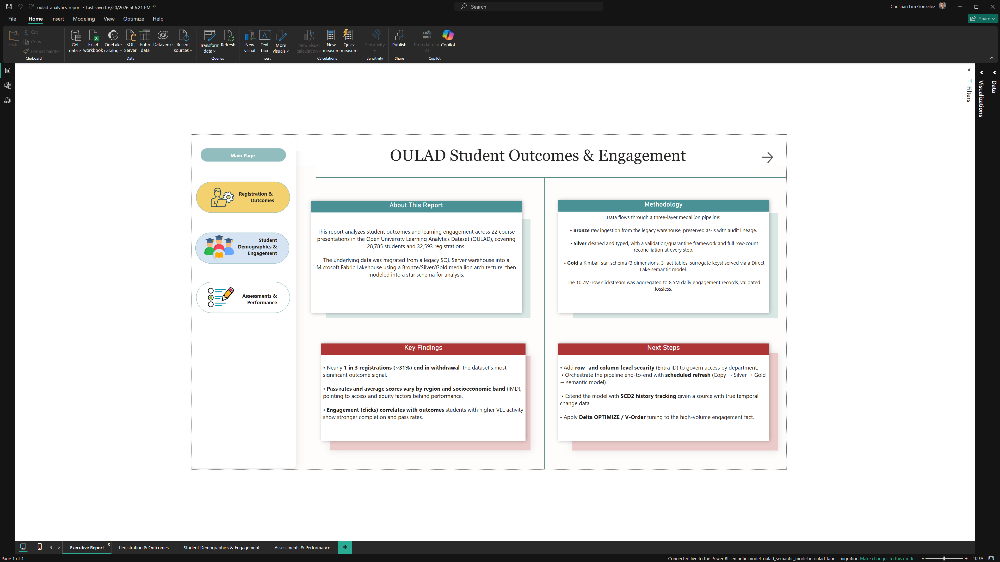
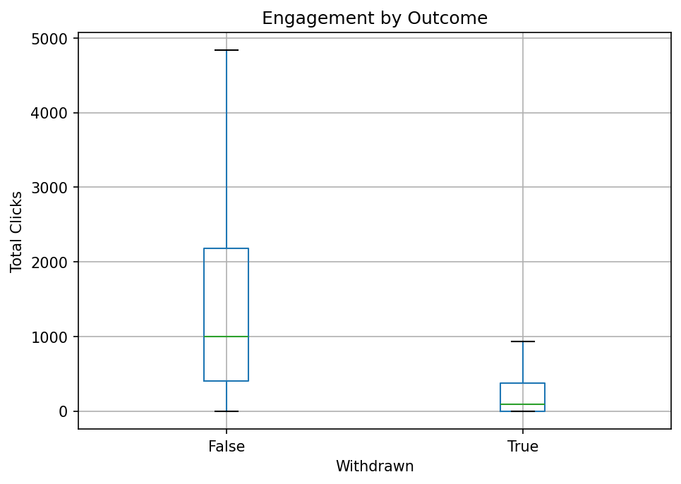

# BI Report Summary OULAD Student Outcomes & Engagement

A companion to the interactive Power BI report (`oulad-analytics-report.Report`), written for readers without Power BI access. All numbers below are pulled directly from the report and verified against source data.

## About This Report

Analyzes student outcomes and learning engagement across 22 course presentations in the Open University Learning Analytics Dataset (OULAD), covering 28,785 students and 32,593 registrations. Migrated from a legacy SQL Server warehouse into a Microsoft Fabric Lakehouse using a Bronze/Silver/Gold medallion architecture, then modeled into a star schema for analysis.

## Key Findings

All three findings below were checked against actual group sizes before being reported, none is driven by a small sample.

- **Withdrawal tracks education level in a clean, monotonic gradient** from 23% (postgraduate, n=252) up to 43% (no formal qualifications, n=306), holding through the two largest groups too (A-Level: 28% of 12,355; Lower- than-A-Level: 35% of 11,780).
- **Withdrawal tracks socioeconomic deprivation (IMD band) in an even cleaner gradient** 37% in the most-deprived decile down to 26% in the least- deprived, across bands all above 2,200 students.
- **Withdrawal is remarkably stable across region** (23%–35% across all 11 UK regions), geography is not where this outcome gap lives; socioeconomic and educational factors are the stronger signal.

## Recommendations

- **Prioritize early-intervention outreach by prior education, not just overall risk score.** Students with no formal qualifications and lower-than- A-level together represent over 12,000 students, a large, identifiable population.
- **Weight socioeconomic deprivation (IMD) at least as heavily as academic risk signals.** The most-deprived bands (~9,270 students combined) show withdrawal 6–11 points above the least-deprived, financial/access-based support, not just academic tutoring, is the more direct intervention.
- **Don't allocate support budget by region.** Withdrawal is flat across geography; a regional program would likely underperform one targeted by education level or IMD band instead.
- **Investigate the "Unknown" IMD population (971 students, 21% withdrawal, lower than every mapped band)** before excluding them from equity-based support this may be a genuinely different population (e.g., international or distance students) rather than random missing data.

## Engagement Is a Real Predictor, Not Just a Visual Impression

The report shows engagement (clicks) varies sharply by module, up to a 20x spread. That alone doesn't prove engagement predicts outcome, so it was tested directly with a separate statistical analysis (see [`analysis/engagement_outcome_validation.ipynb`](../analysis/engagement_outcome_validation.ipynb)): students who stayed enrolled clicked a median of 994 times; students who withdrew clicked a median of 90, an 11x gap, with a moderate-to-strong statistical correlation (r = -0.36, p < 0.000001, n = 32,593).

This doesn't prove engagement *causes* retention, highly-engaged students may simply be more committed generally, but it's a real, substantial relationship worth acting on, not a coincidence of chart design.

## Methodology

Bronze (raw ingestion, audit lineage) to Silver (cleaned, typed, quarantine framework for invalid records) to Gold (Kimball star schema, 3 dimensions, 3 fact tables) to Direct Lake semantic model to Power BI report. Full technical detail in the main [README](../README.md).